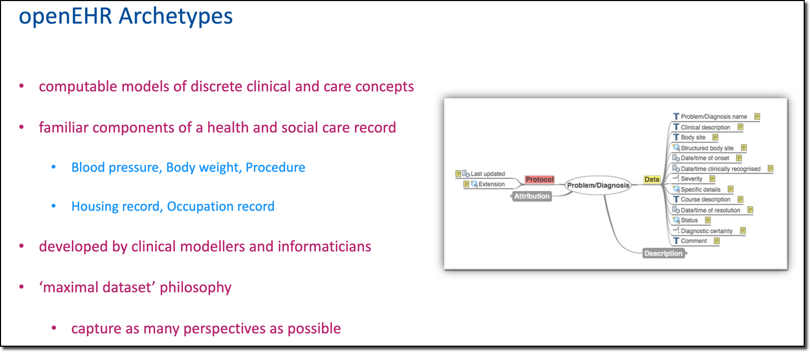
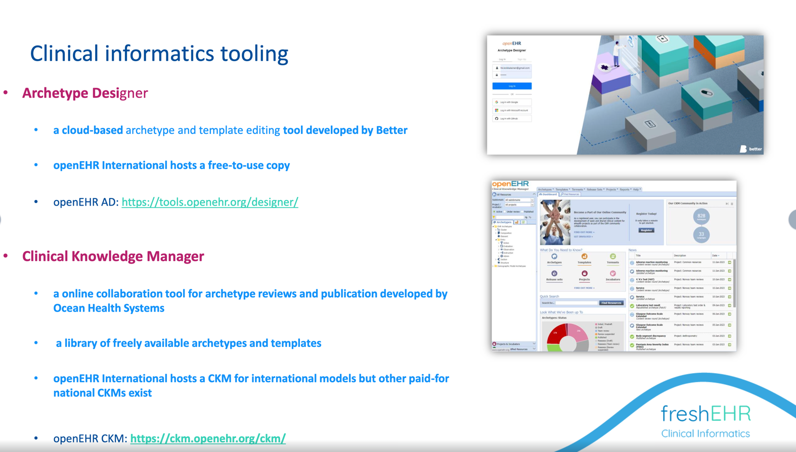

# Apperta NHS Pharmacogenetics archetype reviews

## Introduction

This project aims to build and publish a number of openEHR archetypes and templates which relate to Pharmacogenetics, to support decision support in frontline clinical systems with the ultimate aim of having these re-published by openEHR International.

## openEHR archetypes and templates

For those not familiar with openEHR, this [short introductory video](https://youtu.be/uWBAeu464rM?t=62) may be helpful - watch until about 15m 20s.

Archetypes are definitions of components of information to be stored in a healthcare record or application. For example how to record a blood pressure, or a diagnosis, or a specific PROM like EQ-5D.

###
This short video explains the project:

<iframe src="https://player.vimeo.com/video/840448757?badge=0&amp;autopause=0&amp;player_id=0&amp;app_id=58479" frameborder="0" allow="autoplay; fullscreen; picture-in-picture" allowfullscreen style="position:absolute;top:0;left:0;width:100%;height:100%;" title="Kanthan_MSK_HQ_Overview_CKM"></iframe>

###
The non-profit openEHR community works directly with clinicians and other health and care professionals to define and then freely share the archetypes and templates, using tools that non-engineers can use to create and review the archetypes.

## Reviewing archetypes

Building archetypes is normally done by clinical informatics but they need to be reviewed by specialists in the subject, in this case people with a knowledge of Pharmacogenetics.

We use a special tool called 'Clinical Knowledge Manager' for this purpose, inviting people to review the archetype on-line.

The CKM tool we are initially using for this project is hosted by Apperta on behalf of openEHR UK, specifically for UK-based projects.

You will receive a specific email invitation to participate as a reviewer. There is absolutely no cost and we promise not to hassle you with too many reminders - you can opt out at any point.

The process is straightforward but you might find it helpful to watch this [Video walk-through](https://vimeo.com/842865092?share=copy) of what is involved.

<iframe src="https://player.vimeo.com/video/842865092?badge=0&amp;autopause=0&amp;player_id=0&amp;app_id=58479" frameborder="0" allow="autoplay; fullscreen; picture-in-picture" allowfullscreen style="position:absolute;top:0;left:0;width:100%;height:100%;" title="Introduction to archetype reviews on Apperta CKM"></iframe>
 

This [Reviewing archetypes](./CKM-001-%20Reviewing-an-Archetype-on-CKM.md) page might also be helpful.

When reviewing archetypes, remember that these are not 'forms' as such - they are definitions of the information that sits beneath, so don't worry about the exact appearance.

